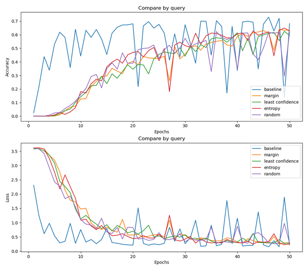
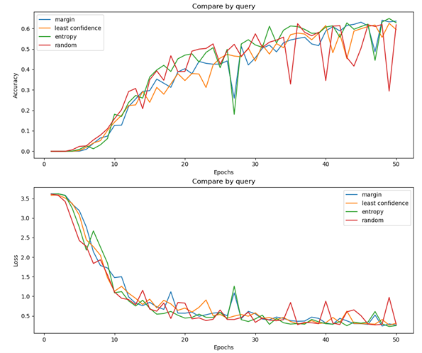

# CAPTCHA-classification_active_learning
CAPTCHA classification with active_deep_learning<br/>

<br/><br/>
Dataloader code: captcha_dataset.py<br/>
Model code: Network.py<br/>
Train, Test code: main.py<br/>
<br/>

## Reference
https://github.com/DongJooKim1541/CAPTCHA-classification

<br/>

## Application technology
```
Python  
Active learning
CNN(Convolutional Neural Network)
RNN(Recurrent Neural Network)  
Pytorch  
```


## Dataset 
https://www.kaggle.com/datasets/akashguna/large-captcha-dataset


## Instructions
1. Unzip the zip file and put it in the pycharm project directory<br/>
2. Adjust the channel tensor of the network according to the image size<br/>
3. The original image data is 256 x 256 and the image data used in the project is 256 x 256.

<br/>

## Active learning

Random sampling(Done)<br/>
Margin sampling(Done)<br/>
Entropy(Done)<br/>
Least confidence(Done)

<br/>

## Experimental Results

 
Accuracy and loss(with baseline)

<br/>
<br/>

 
Accuracy and loss(Only active learning method)
